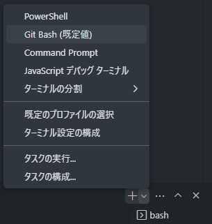
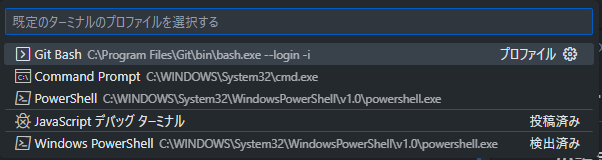
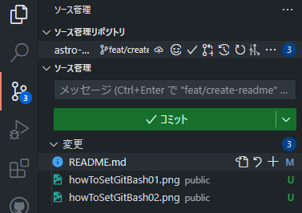
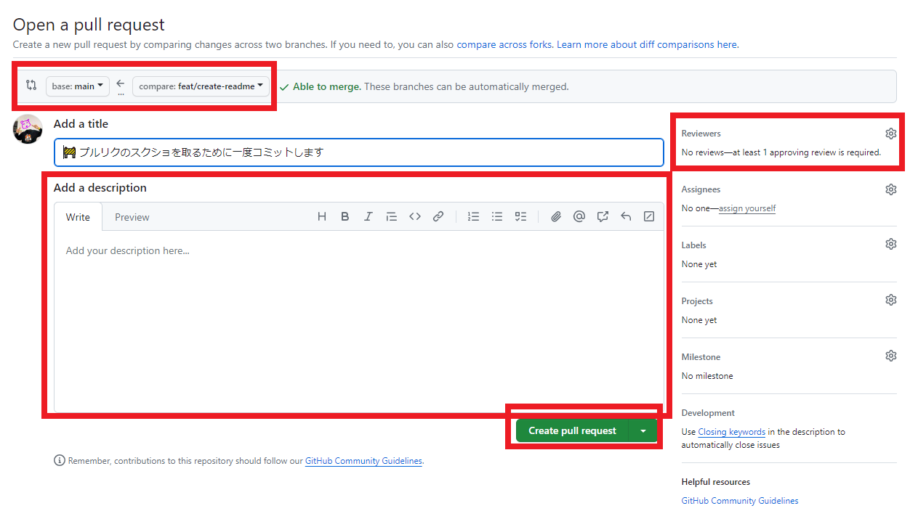

# チュートリアル！！！
## この設定するとめちゃ便利！
### vscodeの拡張機能を入れよう

手順  
1. [Ctrl] + [Shift] + [K]を押して拡張機能を開く
2. 検索バーに下の３つを入力してインストールする

- astro-build.astro-vscode
- mhutchie.git-graph
- vscode-icons-team.vscode-icons

### gitBashをデフォルトのターミナルにする

手順  
1. [Ctrl] + [Shift] + [@]を押してターミナルを開きます
2. ターミナル右上の方にある▽マークをクリックして、メニューを開く
3. 既定のプロファイルの選択をクリック



4. GitBashを選択します



## 開発の流れ
1. `cd` や `code .` コマンドを使う or 左上の「ファイル」→「フォルダを開く」から作業するフォルダに移動します。
2. 自分の作業するブランチを最新の状態にします。
   1. development ブランチに移動する
   ```
    git switch development
   ```
   2. development ブランチを最新の状態にする
   ```
    git pull origin development
   ```
   3. ①自分の作業するブランチに戻る（例： `feat/navBar` で作業したい）
   ```
    git switch feat/navBar
   ```
   3. ②新しくブランチを作成するときは以下のコマンド(4.のmergeはしなくて良い)
   ```
    git switch -c feat/navBar
   ```
   4. 自分の作業ブランチを更新する
   ```
    git merge development
   ```
3.  作業する前の準備をします。
    1.  おまじないをします
    ```
    npm i
    ```
    2. サーバを立ち上げます
    ```
    npm run dev
    ```
    3. ブラウザでページを開きます  
    [http://localhost:4321/](http://localhost:4321/)
4. 作業します。
    1. 定期的にコミットをしましょう
       1. [Ctrl] + [Shift] + [G]でソース管理を開きます。
       2. 変更した部分をステージングします(ファイル名の右横の+ボタンを押す)
       
       3. コミットメッセージを入力します(どこを変更したのかを書こう！)
       4. 「コミット」をクリックしてコミットします
       5. ターミナルに以下のコマンドを入力してgithubにプッシュします(例： `feat/navBar` で作業してる)
       ```
       git push origin feat/navBar
       ```
5. 作業が終わったら「プルリクエスト」を送ってマージしてもらいます。
   1. githubの作業リポジトリのページに移動します  
   [https://github.com/NITACwpl/astro-github-dojo/](https://github.com/NITACwpl/astro-github-dojo/) とか
   2. 「Pull requests」タブに移動します
   3. 緑色の「New pull request」ボタンをクリックします
   4. どのブランチからどのブランチにマージするのかを確認します
   5. プルリクのdescriptionとreviewersを追加します
       - reviewersってのは自分のコードを確認してもらう人のこと。つよつよにレビューしてもらいましょう
   
   6. 「Create pull request」をクリックしてプルリクを送ります
   7. ここを直して～って言われたらもっかい変更→コミット→プッシュをします。
   8. 無事マージされたら完了！

## Q&A
- いつ「コミット」するの？
  - 変更ごとに送ります。細かいほうが、変更履歴を確認するときや元に戻すときに便利です。
  - はじめのうちは細かすぎるかも？？ってくらいの頻度でコミットするのがオススメ！
- いつ「プッシュ」するの？
  - いつでもOk
  - 全部の作業が終わってプルリクを送る前でも良き
  - 1日の終わりとかにするのが丁度良さげ
- いつ「プルリクエスト」を送るの？
  - そのブランチでの作業が終わったらプルリクエストを送ってマージしてもらおう